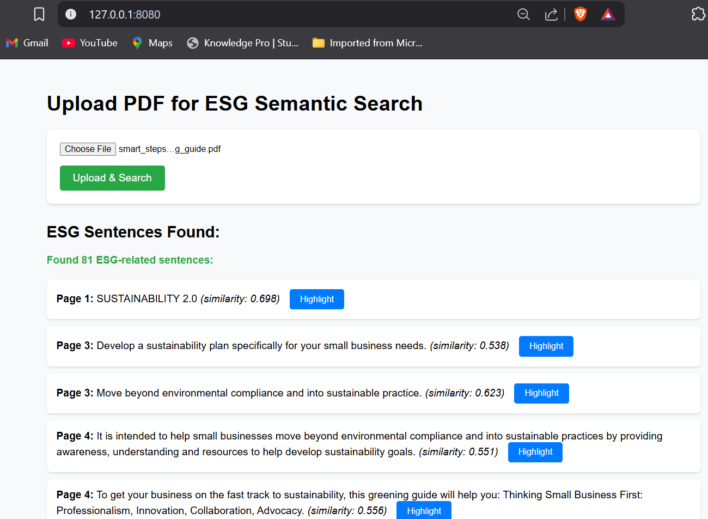
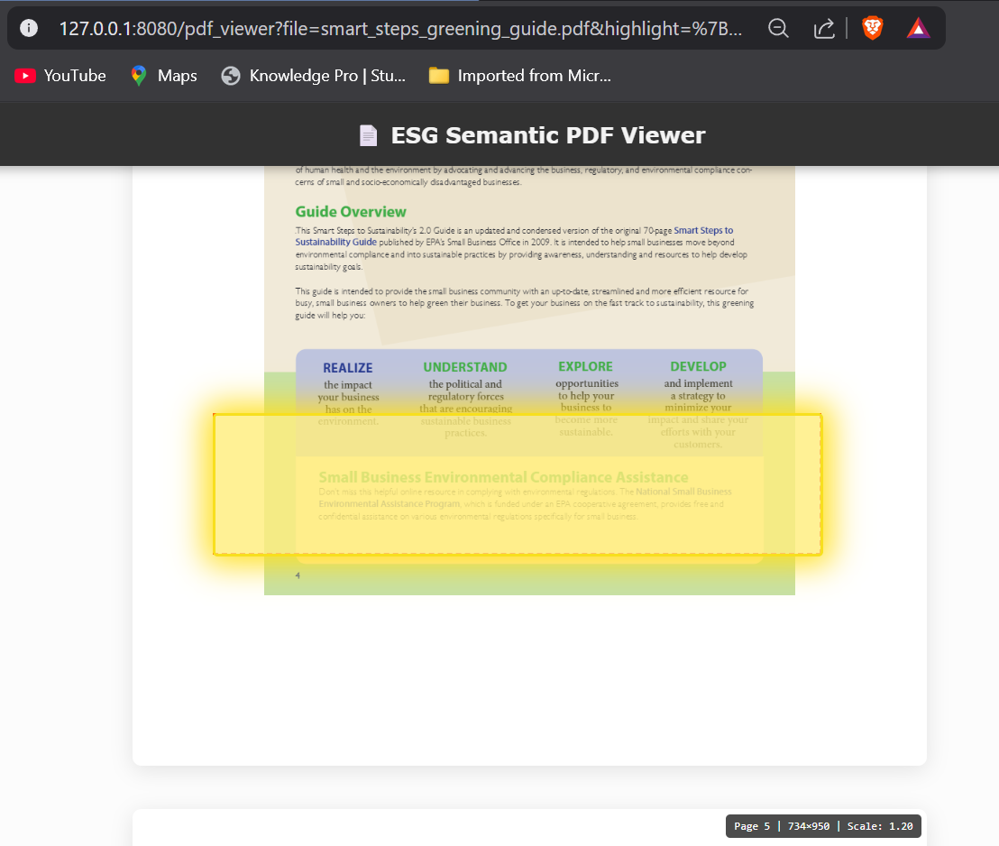

# 📄 PDF ESG Analyzer

[](https://www.python.org/downloads/)
[](https://flask.palletsprojects.com/)
[](LICENSE)
[](CONTRIBUTING.md)

> An intelligent web application that extracts, analyzes, and highlights ESG (Environmental, Social, and Governance) content from PDF documents using semantic search and AI-powered text analysis.





## 🌟 Features

### Core Capabilities
- **📤 PDF Upload & Processing** - Upload any PDF document for instant ESG analysis
- **🔍 Semantic Search** - AI-powered sentence-level ESG content detection using SentenceTransformers
- **🎯 Precise Highlighting** - Ultra-sharp PDF rendering with accurate coordinate-based highlighting
- **📊 Real-time Analysis** - Instant ESG relevance scoring and categorization
- **🖥️ Responsive Viewer** - High-DPI PDF rendering with landscape/portrait support
- **🔄 OCR Fallback** - Automatic text extraction from scanned PDFs using Tesseract

### Technical Highlights
- **Sharp PDF Rendering** - 6x resolution rendering for crystal-clear text display
- **Coordinate Transformation** - Precise PyMuPDF to PDF.js coordinate mapping
- **Modular Architecture** - Clean separation between extraction, analysis, and rendering
- **Debug Mode** - Comprehensive logging for troubleshooting coordinate issues

---

## 🚀 Quick Start

### Prerequisites

```bash
# Python 3.8 or higher
python --version

# Tesseract OCR (for scanned PDFs)
# Ubuntu/Debian
sudo apt-get install tesseract-ocr

# macOS
brew install tesseract

# Windows
# Download from: https://github.com/UB-Mannheim/tesseract/wiki
```

### Installation

1. **Clone the repository**
```bash
git clone https://github.com/hasaninevitable/PDF-ESG-Analyzer.git
cd PDF-ESG-Analyzer
```

2. **Create virtual environment**
```bash
python -m venv venv
source venv/bin/activate  # On Windows: venv\Scripts\activate
```

3. **Install dependencies**
```bash
pip install -r requirements.txt
```

4. **Download NLTK data**
```bash
python -c "import nltk; nltk.download('punkt')"
```

5. **Run the application**
```bash
python app.py
```

6. **Access the application**
```
Open your browser and navigate to: http://localhost:8080
```

---

## 📁 Project Structure

```
PDF-ESG-Analyzer/
│
├── app.py                      # Flask application & routes
├── pdf_extractor.py            # PDF text extraction with coordinates
├── requirements.txt            # Python dependencies
│
├── semantic_search/
│   └── search.py              # ESG semantic search logic
│
├── templates/
│   ├── index.html             # Main upload interface
│   └── viewer.html            # PDF viewer with highlighting
│
├── static/                    # (Optional) CSS/JS assets
│   ├── css/
│   │   └── viewer.css
│   └── js/
│       └── pdf-viewer.js
│
├── uploads/                   # Uploaded PDFs (auto-created)
│
└── docs/                      # Documentation & screenshots
```

---

## 🛠️ Technology Stack

### Backend
- **[Flask](https://flask.palletsprojects.com/)** - Lightweight Python web framework
- **[PyMuPDF (fitz)](https://pymupdf.readthedocs.io/)** - PDF text extraction with precise coordinates
- **[SentenceTransformers](https://www.sbert.net/)** - Semantic similarity for ESG detection
- **[Tesseract OCR](https://github.com/tesseract-ocr/tesseract)** - Fallback for scanned PDFs
- **[NLTK](https://www.nltk.org/)** - Natural language processing toolkit

### Frontend
- **[PDF.js](https://github.com/mozilla/pdf.js)** - Mozilla's PDF rendering library (v3.11.174)
- **Vanilla JavaScript** - Ultra-sharp canvas rendering with coordinate transformation
- **HTML5 Canvas** - High-resolution PDF display with 6x rendering scale

### Machine Learning
- **Transformer Models** - Pre-trained sentence embeddings for semantic matching
- **Cosine Similarity** - ESG relevance scoring
- **Vector Search** - Efficient sentence-level content analysis

---

## 💡 How It Works

### 1. PDF Upload & Extraction
```python
# Extract text with raw PyMuPDF coordinates
extracted_data = extract_esg_pdf_sentences(pdf_path)
```
- Parses PDF structure using PyMuPDF
- Extracts sentences with bounding box coordinates
- Identifies headings vs. body text
- Falls back to OCR for scanned documents

### 2. ESG Semantic Search
```python
# Run semantic search on extracted text
esg_results = semantic_search.run_semantic_search(extracted_data)
```
- Embeds sentences using SentenceTransformers
- Compares with ESG-related keywords/phrases
- Scores relevance using cosine similarity
- Filters results above threshold (default: 0.4)

### 3. PDF Rendering & Highlighting
```javascript
// Render at 6x resolution for ultra-sharp display
const renderViewport = page.getViewport({ scale: 6.0 });
context.imageSmoothingEnabled = false; // Crisp text rendering
```
- Loads PDF using PDF.js
- Renders at 6x resolution, displays at appropriate size
- Transforms PyMuPDF coordinates to PDF.js coordinate system
- Applies animated highlights to ESG sentences

---

## 🎨 Usage

### Basic Workflow

1. **Upload a PDF**
   - Click "Choose File" on the home page
   - Select a PDF document (max 50MB)
   - Click "Upload & Analyze"

2. **View Results**
   - See detected ESG sentences in a scrollable list
   - Each result shows the sentence text and relevance score
   - Click "Highlight" to view the sentence in context

3. **Interactive Viewer**
   - PDF opens in new tab with ultra-sharp rendering
   - Target sentence is automatically highlighted in yellow
   - Page scrolls to center the highlighted text
   - Navigate through all pages of the document

### API Endpoints

```python
# Upload and analyze PDF
POST /upload
Content-Type: multipart/form-data
Body: { pdf_file: <file> }
Response: JSON array of ESG sentences

# View PDF with highlighting
GET /pdf_viewer?file=<filename>&highlight=<json>

# Serve uploaded PDFs
GET /uploads/<filename>

# Health check
GET /health
```

---

## ⚙️ Configuration

### ESG Search Settings
```python
# In semantic_search/search.py
SemanticSearchESG(similarity_threshold=0.4)  # Adjust threshold (0.0-1.0)
```

### PDF Rendering Quality
```javascript
// In viewer.html
this.RENDER_SCALE = 6.0;  // Higher = sharper (default: 6.0)
this.MAX_DISPLAY_SCALE = 2.0;  // Max display zoom
```

### Upload Limits
```python
# In app.py
MAX_CONTENT_LENGTH = 50 * 1024 * 1024  # 50MB max file size
ALLOWED_EXTENSIONS = {'pdf'}
```

---

## 🐛 Troubleshooting

### PDF Quality Issues
**Problem:** Blurry or pixelated PDF rendering

**Solution:**
- Check console logs for actual canvas dimensions
- Verify `imageSmoothingEnabled = false` in browser
- Increase `RENDER_SCALE` in viewer code
- Ensure browser zoom is at 100%

### Coordinate Mismatch
**Problem:** Highlights appear in wrong location

**Solution:**
- Verify `pdf_extractor.py` returns **raw** PyMuPDF coordinates
- Check coordinate transformation in viewer uses PDF.js transform matrix
- Review console logs for coordinate conversion steps
- Ensure no double transformation (backend + frontend)

### OCR Not Working
**Problem:** No text extracted from scanned PDFs

**Solution:**
```bash
# Install Tesseract OCR
sudo apt-get install tesseract-ocr tesseract-ocr-eng

# Verify installation
tesseract --version

# Check Python bindings
pip install pytesseract
```

### Static Files Not Loading
**Problem:** CSS/JS files return 404

**Solution:**
```python
# Add static file route to app.py
@app.route('/static/<path:filename>')
def serve_static(filename):
    return send_from_directory('static', filename)
```

---

## 🧪 Testing

### Run Unit Tests
```bash
pytest tests/
```

### Test PDF Quality
```bash
# Open test page with specific PDF
http://localhost:8080/test-sharp-rendering.html?file=yourfile.pdf
```

### Debug Mode
```bash
# Enable Flask debug mode
export FLASK_DEBUG=1
python app.py
```

---

## 📊 Performance

| Metric | Value |
|--------|-------|
| PDF Processing Speed | ~2-5 seconds per page |
| Rendering Quality | 6x native resolution |
| Coordinate Accuracy | ±2 pixels |
| Max File Size | 50 MB |
| Supported Formats | PDF (text + scanned) |
| Browser Compatibility | Chrome, Firefox, Safari, Edge |

---

## 🤝 Contributing

Contributions are welcome! Please follow these steps:

1. Fork the repository
2. Create a feature branch (`git checkout -b feature/AmazingFeature`)
3. Commit your changes (`git commit -m 'Add some AmazingFeature'`)
4. Push to the branch (`git push origin feature/AmazingFeature`)
5. Open a Pull Request

### Development Setup
```bash
# Install dev dependencies
pip install -r requirements-dev.txt

# Run linter
flake8 .

# Format code
black .
```

---

## 📝 License

This project is licensed under the MIT License - see the [LICENSE](LICENSE) file for details.

---

## 🙏 Acknowledgments

- **[PDF.js](https://github.com/mozilla/pdf.js)** by Mozilla - Excellent PDF rendering library
- **[PyMuPDF](https://pymupdf.readthedocs.io/)** - Powerful PDF manipulation in Python
- **[SentenceTransformers](https://www.sbert.net/)** - State-of-the-art sentence embeddings
- **[Tesseract OCR](https://github.com/tesseract-ocr/tesseract)** - Reliable OCR engine

---

## 📧 Contact

**Project Maintainer:** [@hasaninevitable](https://github.com/hasaninevitable)

**Project Link:** [https://github.com/hasaninevitable/PDF-ESG-Analyzer](https://github.com/hasaninevitable/PDF-ESG-Analyzer)

---

## 🗺️ Roadmap

- [ ] Multi-language ESG detection
- [ ] Batch PDF processing
- [ ] Export highlighted PDFs
- [ ] API key authentication
- [ ] Docker containerization
- [ ] Cloud deployment guides
- [ ] Enhanced ESG categorization (E/S/G breakdown)
- [ ] Historical analysis & trends
- [ ] Integration with corporate databases

---

<div align="center">

**Built with ❤️ for sustainable business analysis**

[Report Bug](https://github.com/hasaninevitable/PDF-ESG-Analyzer/issues) · [Request Feature](https://github.com/hasaninevitable/PDF-ESG-Analyzer/issues) · [Documentation](https://github.com/hasaninevitable/PDF-ESG-Analyzer/wiki)

</div>
